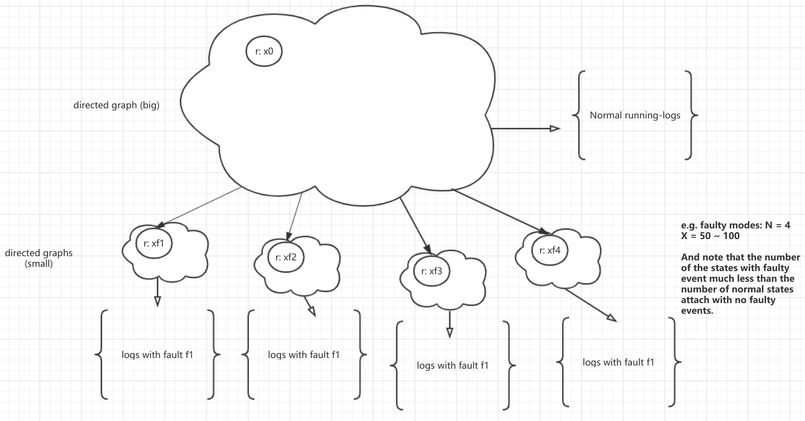
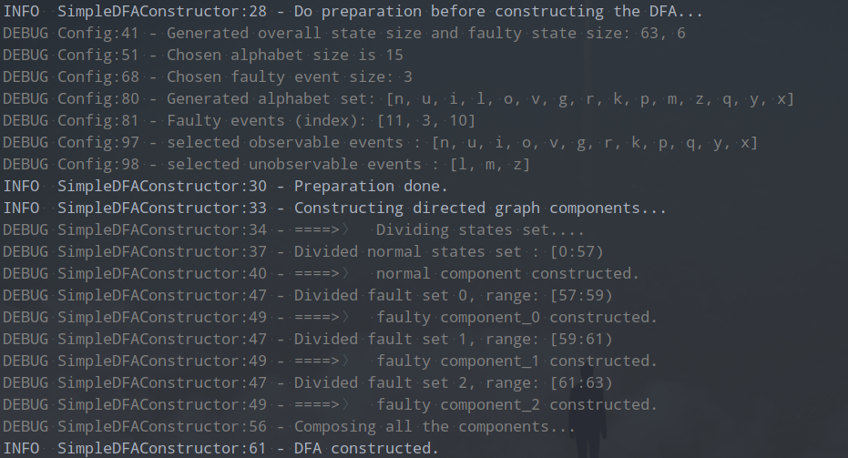
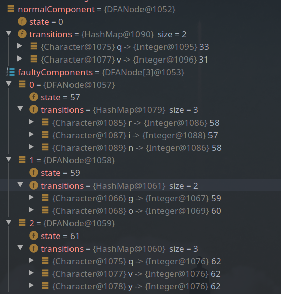
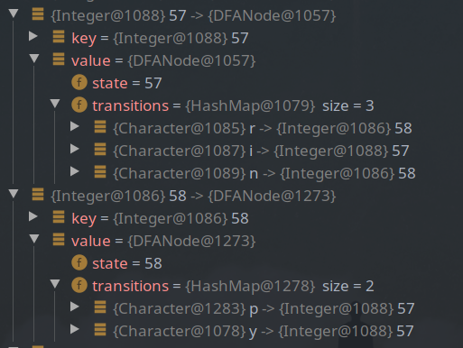
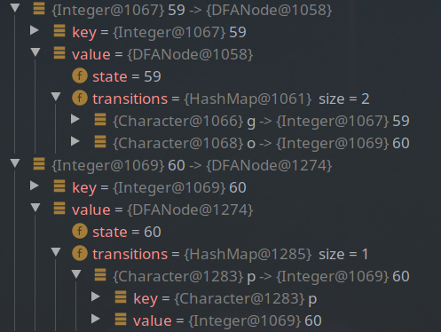
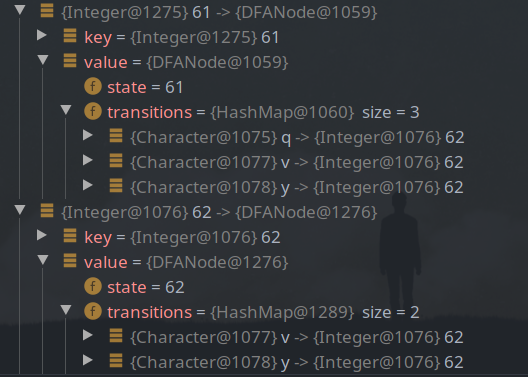
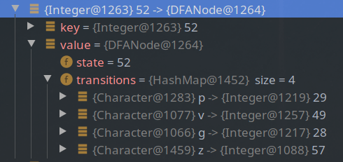
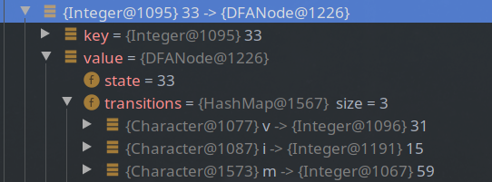
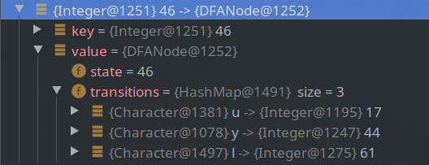

# Random generation of diagnosable DFAs.

最终的目标是可能实现伪随机或完全随机，但是现在是使用人为的方式来构建 complete DFA.

## 1. Constructing a DFA to generate running logs.

现阶段，首先考虑人为构造一个简单的、可诊断的 DFA，以生成可供实验的数据 (running-logs)。

> Conditions:

1. |X| 状态空间大小随机 (50 ~ 500), N = 5 (错误事件集数量，随机产生)；
2. 只考虑单错误模式（即观察 observation 中出现的错误不能叠加）；
3. 根据错误模式数量，人为地将状态集划分为多个状态集 (|$X_{f1}$|, ..., |$X_{fn}$|, |$X_n$|, 一个正常状态集，其他均为错误状态集)；
4. 所有错误状态集中状态加起来应该远小于正常的状态集中的状态数量。

一个简单的例子如下:

> 当前思路
> 1. 使用数据结构：directed graph (有向图) 来构造上面假设中的每个部分
> 2. 每个部分图结构中的节点可以随机连接 (即state transitions 随机)，

Issues: 如何确保在生成 running logs 时，每一种错误类型的观察都能被生成?
> 如何在 正常状态集组成的图中定位到特定的转向某种错误的类型相应组件的节点 (node)。- 该问题如果无法解决，将有可能一直在一个图组件中循环跑。
> **当前解决方案：使用一个数组来记录已访问节点，然后找到指向的下一个节点为需要特定错误节点的的节点。**

当前实现方案:

**DFA component 构造策略**

1. 在构造每个 DFA component 时，为了能够快速完成构造，人为地将给定状态分为 **已访问** ``visited`` 和 **未访问** ``unvisited``, 从一个初节点出发；
2. 为当前节点添加若干个（2 - 4个）状态转换 (state transitions), 并确保有至少有一个是未访问的状态；
3. 将当前节点标记为已访问，随机选择当前节点转换中能够到达未访问状态节点的转换。
4. 重复 2,3 直到所有的状态均被访问。

> NOTICE: 上面构造过程中，添加的所有状态转换均使用 observable events。 状态之间可以存在环，自环。

**DFA 各组件组合**

即将一个由正常状态集构造的组件与其他所有由错误状态集构造的组件进行组合。

对于每种错误模式:
- 从正常状态集构造组件 root 节点出发，随机进行若干次状态转换（到达某个状态, 并确保不是经过非观察事件到达的）;
- 为此状态添加一个能够到达该错误模式组件的状态转换。

> 以上组合策略，确保了正常状态集和每个错误模式状态集之间只有一个状态转换（用该错误事件作为 label），并且只要通过某一错误状态转换到达某一错误模式状态集后，无法再从该错误模式状态集中出来。

**running logs 日志生成**

受限于上面提到的构造方式，目前可行的方案是：
- 从 root 节点，出发，随机进行 n 次状态转换（不区分节点是否已访问），停止后，将生成的 observation 观察打上一个标签 label，从而产生一个 log.

> NOTICE: 这种产生日志方式会有可能有重复日志出现 (进行去重复操作)。

### Example

使用上面方式生成 DFA 的一个例子。

> 图示，选择的总状态集大小为 63, 错误状态集大小为 6, 输入字母表 alphabet 大小为 15, 错误事件集 (unobservable) 大小为 3, 错误事件集为 ``[l, m, z]``。
>
> 选择 states[0,56] 来构建状态状态集， states[57,58], states[59:60], states[61:62] 作为错误状态集。

使用 debug 的方式，来查看我们构建出来的组件, DFA。

> 一个正常状态集构成的组件，三个错误状态集构成的组件。

1. 错误状态集 1 (states[57:58]) 构建的组件

2. 错误状态集 2 (states[59:60]) 构建的组件

3. 错误状态集 3 (states[61:62]) 构建的组件

> 可以看到，每个错误状态组件中发生的状态转换，得到下一个状态只能是该组件中的状态。

并且，对于每个错误状态组件，正常状态组件中只有一个相应的错误状态转换。将正常状态组件与所有错误状态组件连接后，正常状态组件中存在错误状态转换的节点如下:

1. 错误事件 ``z`` 对应的状态转换

2. 错误事件 ``m`` 对应的状态转换

3. 错误事件 ``l`` 对应的状态转换

> NOTICE: 允许多个错误状态转换出现在同一个节点上。

以上是一个简单的 DFA 构建例子，状态集比较小，为了满足错误状态集远小于正常状态集，这使得每个错误状态集变得更小。

### Remarks

根据 DES 的可诊断性定义，当前构造方式的构造的 DFA 是可诊断的，因此产生的所有 running-logs 数据就是符合要求的数据。

### Issues

当前实现方案中，产生的 DFA，它的错误状态集比小，则当一个节点通过状态转换到达某个错误状态集组件中时，它后续进行的状态转换，产生的 observation 会有明显的规律。

#### 1. 可诊断性无法保证。需要利用 jiang 的多项式时间判断方法来确定 DFA 的可诊断性。

#### 2. 产生的日志冲突问题如何解决

#### 3. 当前的模型评估方式存在问题

1. 只对生成的日志负责
2. 需要构造 **诊断器** 来判断日志的真实类别 
