# Random generation of diagnosable DFAs.

Generating diagnosable DFAs randomly to simulate real DESs. Then we use the constructed DFAs to generate running-logs
dataset.

    
    fig 1&nbsp;&nbsp;Single Faulty mode DFA architecture illustration

    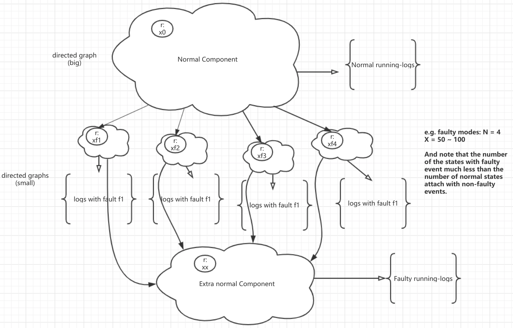
    Fig 2 Single faulty mode DFA with extra normal state compoent architecture

## Examples

1. Single faulty mode: one generated running log can only contain one faulty event.
2. Multiply faulty mode: one generated runing log can contain multiply faulty events.

    

        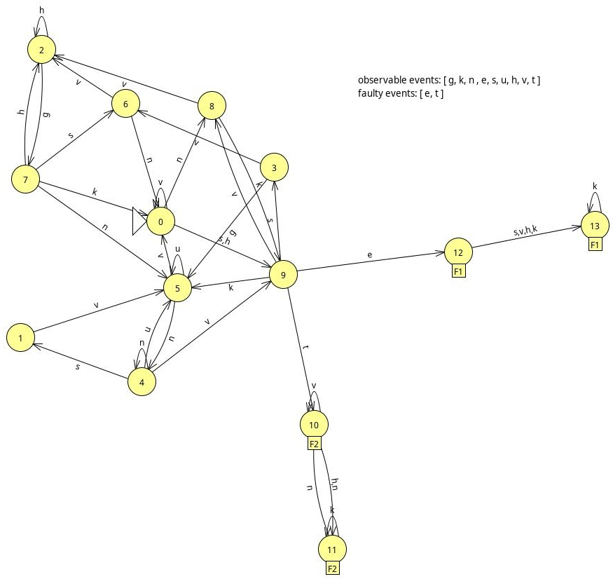
    

    

        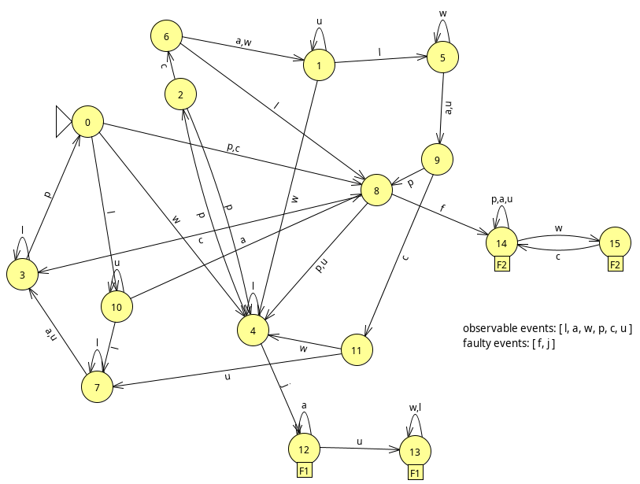
    

    

        
    

    

        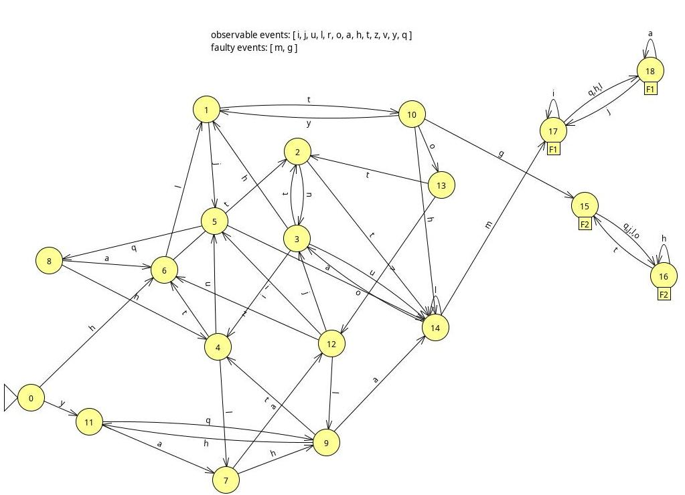
    

    

        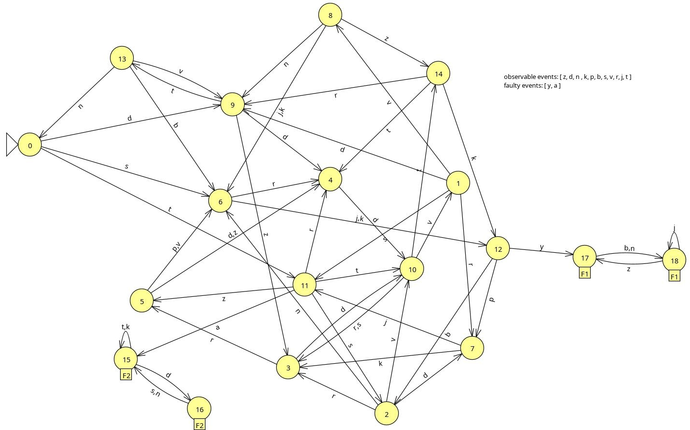
    

    

        
    

    Fig 3 Generated DFA examples

### Diagnosability testing

Using the algorithm proposed by Jiang SengBin - ([A polynomial Algorithm for Testing Diagnosability of Discrete-Event System](https://ieeexplore.ieee.org/document/940942) ) to test the diagnosability of the generated DFAs.

e.g.

1. Generated **single faulty**  DFA without extra normal component。

    

2. Obtains a nondeterministic finite machine of the given DFA.

    

3. Computes the product composition of the two same nd-observer got above.

    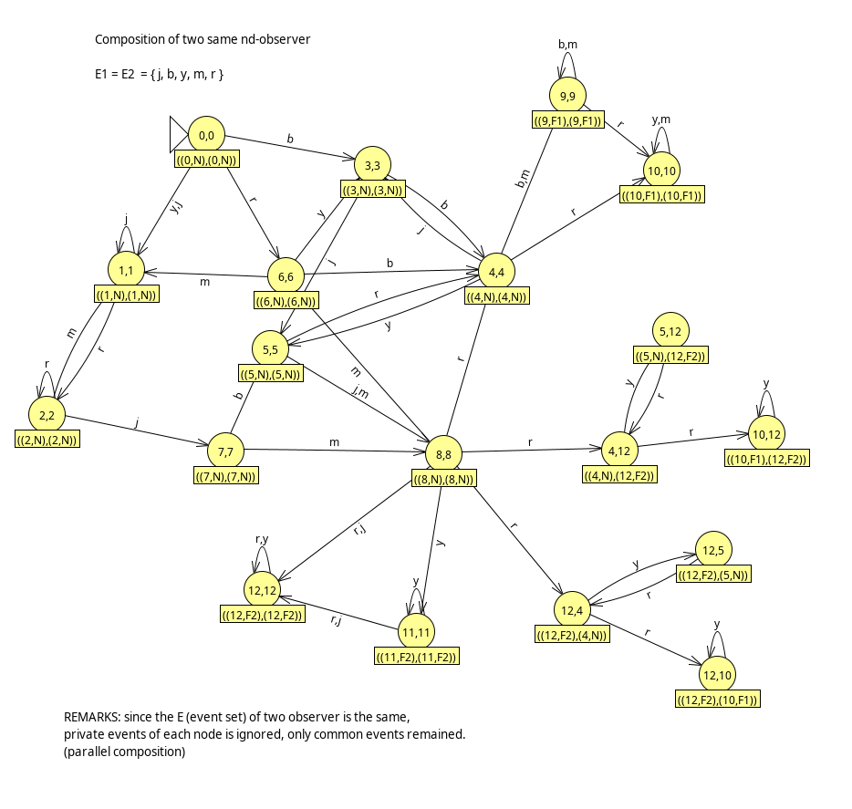

4. Checking whether there exists a cycle starting from nodes whose state has different labels.

> This DFA  is not diagnosable。

The following is a example that generated dfa with **single-faulty mode** and **extra normal component**.

1. The architecture of the given constructed dfa.

    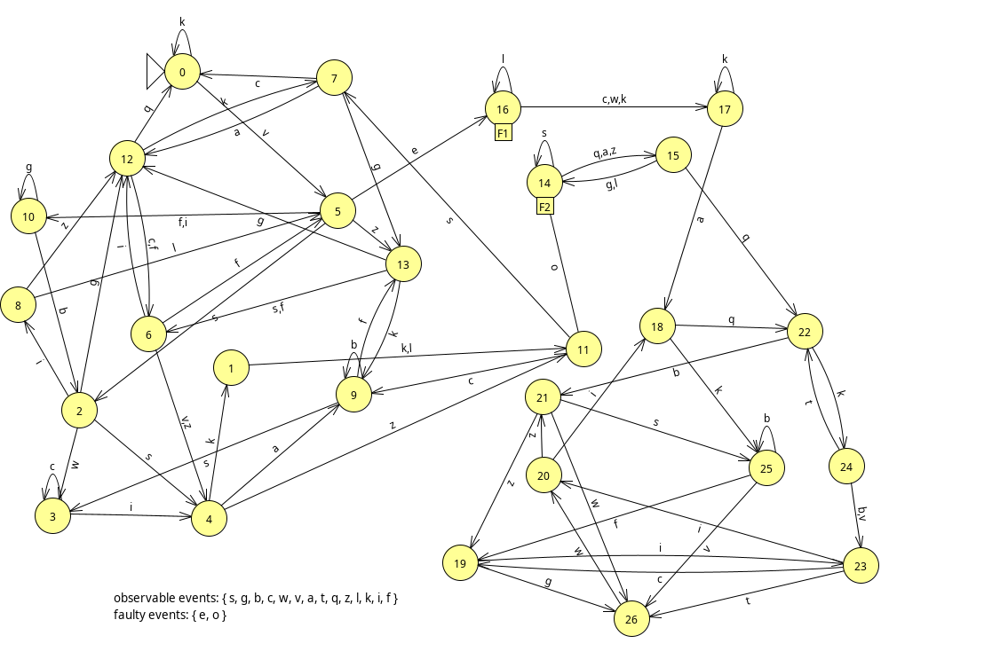

2. Obtains a nondeterministic finite machine of the given dfa.

    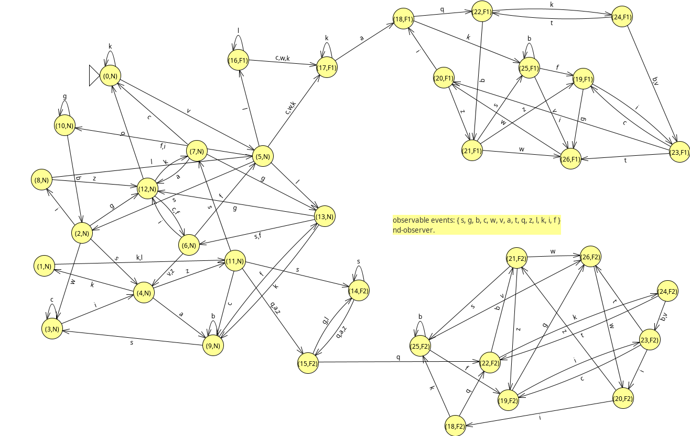

3. Computes the product composition of the two same nondeterministic finite machines got before.

    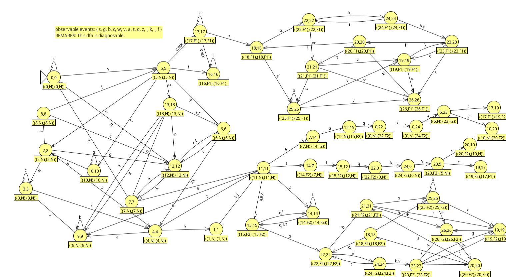

> This constructed dfa is diagnosable.

The following is an example that generated dfa with **multi-faulty mode** and **extra normal component**.

1. The architecture of the constructed dfa.

    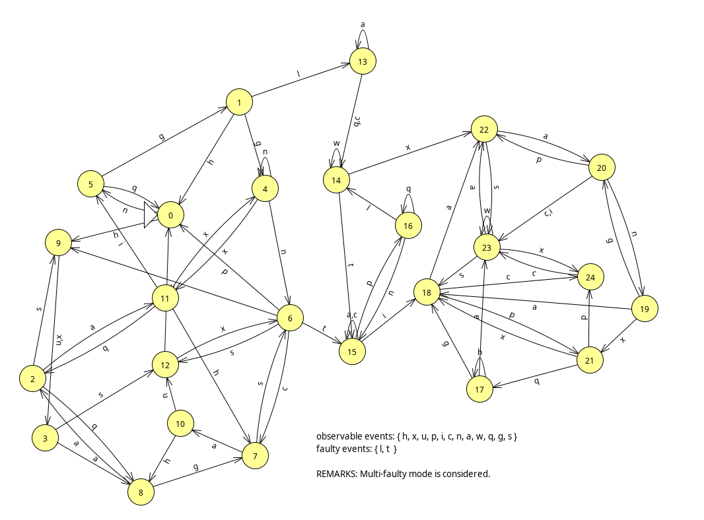

2. Obtains nondeterministic finite machine of the given dfa.

    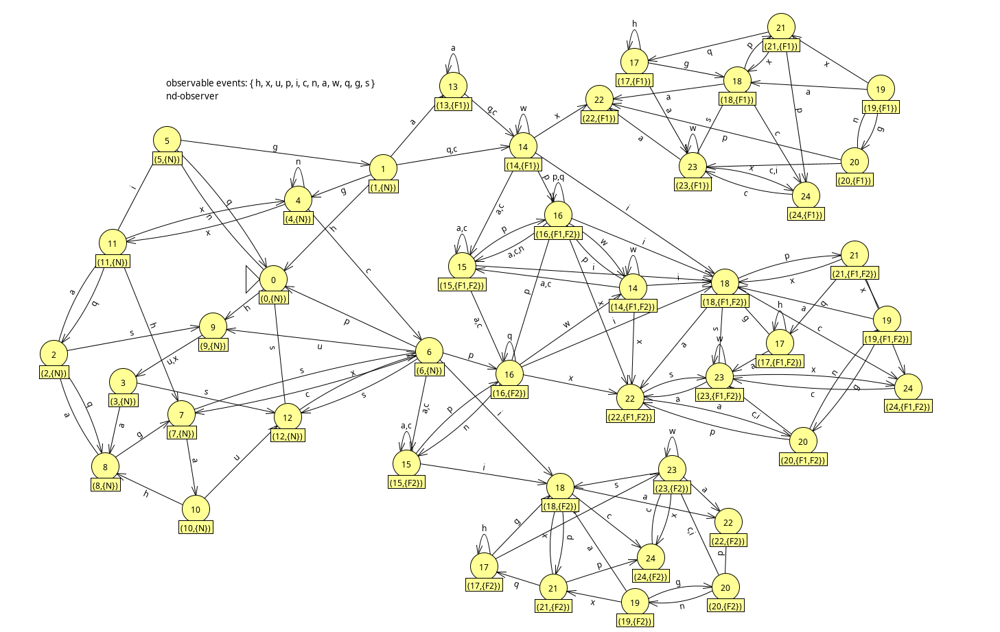

3. Computes the product composition of two same nd-observer got above.

    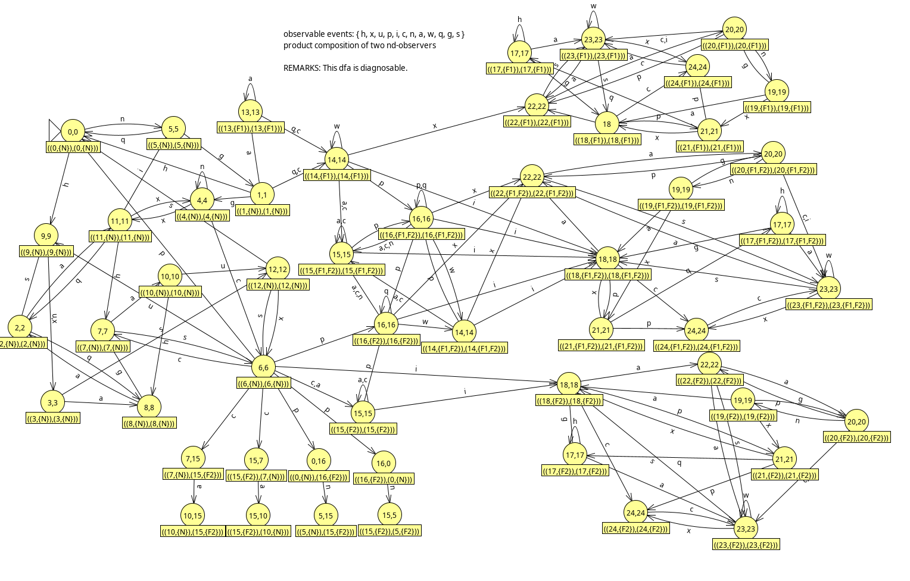

> This dfa is diagnosable.

